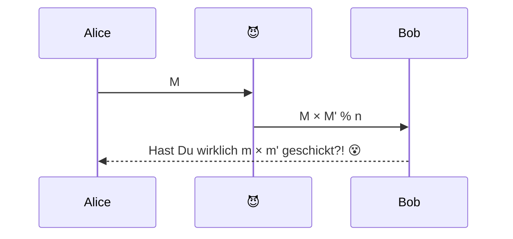
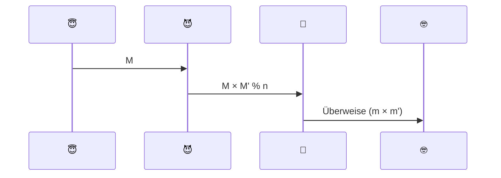
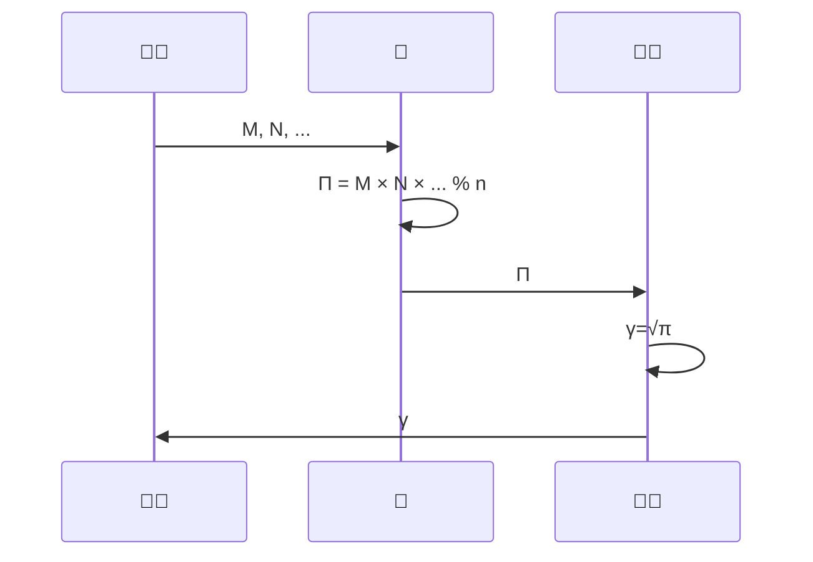

# FDI Practical 3: Malleability

|    ⏰ | what                                 |
| ---: | ------------------------------------ |
|  10' | Modulare Addition und Multiplikation |
|   5' | Formbarkeit                          |
|   5' | Angriff                              |
|  10' | Banküberfall                         |
|  10' | Inversen                             |

|    ⏰ | what                                       |
| ---: | ------------------------------------------ |
|   5' | Liebesbriefe                               |
|  15' | Bearbeitungszeit                           |
|   5' | padding                                    |
|   5' | homomorphische Verschlüsselung Vortrag     |
|  10' | Bearbeitung homomorphische Verschlüsselung |

# Modulare Arithmetik

Grundsätzlich: $a = qn + r$, $b = ln + s$. (Hierbei sind $k, l$ die Quotienten, und $r,s$ die Reste; und $r = a \mod n$ und $s = b \mod n$):

1️⃣ Für alle $x, k$, gilt $x \mod n = (kn + x) \mod n$

* Für die LS: $x \mod n = r$, 
* Für die RS: $x = qn + r$, dann ist $kn + x= kn + qn + r = n(q + k) + r$. Das ist die Definition von $x \mod n$, mit $(q + k) = k'$

2️⃣ Modulare Addition: $(a + b) \mod n = \left( ( a \mod n ) + ( b \mod n ) \right) \mod n$

* LS: $(k \cdot n + r) + (l \cdot n + s) \mod n = n(k + l) + r + s \mod n$. Dank 1️⃣ $= r + s \mod n$
* RS: $r + s \mod n$

3️⃣ Modulare Multiplikation: $ab \mod n = (a \mod n) \cdot (b \mod n) \mod n$

* LS: $( kn + r) (ln + s) \mod n = (kln^2 + kns + rln + rs) \mod n$. Dank 1️⃣ $=rs \mod n$
* RS: $rs \mod n$ 

# Formbarkeit

Um eine Nachricht mit RSA zu verschlüsseln, verwenden Sie für einen gegebenen öffentlichen Schlüssel $(n, c)$ folgende Formel: $M = m^c \mod n$. Nehmen wir eine zweite Nachricht $m'$ an, welche zu $M'$ verschlüsselt wird.

✍️ Berechnen Sie für gegebene $m, m'$ $M \cdot M' \mod n$. 

$$M \cdot M' \mod n = (m^c \mod n) \cdot (m'^c \mod n) \mod n = \\ (m^c \cdot m'^c) \mod n = (m \cdot m')^c \mod n$$

✍️ Berechnen Sie die Verschlüsselung von $m \cdot m'$. Was fällt Ihnen auf?

$$(m \cdot m')^c \mod n$$

Diese Eigenschaft von RSA nennen wir *Formbarkeit* (🇬🇧 *malleability*). Sie bedeutet, dass wenn zwei Nachrichten $m, m'$ mit dem selben Schlüssel RSA-verschlüsselt werden, dass das Produkt ihrer Verschlüsselungen gleich der Verschlüsselung ihres Produkts ist: 

🤯 $$Enc(mm') \mod n = Enc(m) \cdot Enc(m') \mod n = M \cdot M' \mod n$$, oder, wenn wir die Kongruenznotation verwenden:

$Enc(mm') \equiv_n = Enc(m) \cdot Enc(m') \equiv_n M \cdot M'$

# Angriff

Warum ist das bemerkenswert? Stellen Sie sich vor, Alice schickt eine verschlüsselte Nachricht $M$ an Bob. Sie hat diese Nachricht mit Bobs öffentlichem Schlüssel verschlüsselt.

☝️ Wenn Algorithmen und Protokolle der Cyber-Sicherheit besprochen werden, dann müssen meistens Alice, Bob und Eve als Beispiel-Namen herhalten. Alice und Bob möchten ungestört geheime Informationen austauschen, wohingegen Eve die Leitung abhört und versucht, Schabernack zu treiben.

Eve fängt in unserem Beispiel die Nachricht $M$ ab, und verschlüsselt mit Bobs öffentlichen Schlüssel eine weitere Nachricht $m'$. Sie schickt das Produkt der beiden Verschlüsselungen $M \cdot M' \mod n$ an Bob weiter:

Bob erhält diese Nachricht, und wir denken, dass Alice ihm die Nachricht $m \cdot m'$ geschickt hat!

Als Empfänger einer verschlüsselten Nachricht habe ich also keine Sicherheit, dass die Nachricht tatsächlich so vom Sender geschickt wurde. Zwar kann ein Angreifer den Inhalt der ursprünglichen Nachricht ohne den privaten Schlüssel nicht lesen, aber er kann trotzdem die Nachricht verfälschen.

# Banküberfall!

Sie (😇) schicken eine Nachricht an Ihre Bank (🏦), die den Betrag für eine geplante Überweisung an eine vorbestimmte Adresse (🤓) enthält. Die Nachricht ist also lediglich eine Zahl, bspw. $m = 12$. Sie verschlüsseln diese Zahl mit dem öffentlichen Schlüssel der Bank $(133, 5)$ zu $M$. 

Eve (😈) hat mit diesem vorbestimmten Empfänger der Überweisung eine Abmachung getroffen: Eve sorgt dafür, dass die Bank in Ihrem Namen deutlich mehr überweist, als Sie ursprünglich in Auftrag geben wollten. Im Gegenzug wird der vorbestimmte Empfänger einen den Überbetrags mit Eve teilen. Was muss Eve nun tun, um ihren Teil der Abmachung einzuhalten?

* $M = m^c \mod n = 12^5 \mod 133 = 122$

⚠️ Eve darf jetzt aber nicht zu gierig sein: Jede Nachricht, die mit dem öffentlichen Schlüssel $(n, c)$ verschlüsselt wird, muss zwischen $0$ und $n - 1$ liegen.

* $M' = m'^c \mod n = 10^5 \mod 133 = 117$

* $MM' \mod n = 122 \cdot 117 \mod 133 = 43$

Zur Entschlüsselung verwendet die Bank ihren privaten Schlüssel: $MM' ^ d \mod n = 43^{173} \mod 133 = 120$ (was $12 \cdot 10$ ist). Eve hat als ihren Teil der Abmachung eingehalten!

# Modulare Inversen

Wenn Eve wollen würde, dass ein bestimmter Betrag $x$ überwiesen wird, müsste sie die *modulare Inverse $m^{-1}$* berechnen, wobei $m \cdot m^{-1} \mod n \equiv 1 \mod n$. Wie man diese berechnet, behandeln wir nicht (für neugierige: ➡️ Erweiterter euklidischer Algorithmus), aber es ist gut, wenn Sie eine Vorstellung davon haben, dass es solche Inversen (meistens) gibt.

Für $m = 12 \mod 133$  ist $m^{-1} \equiv 122 \mod 133$, weil $122 \cdot 12 \mod 133 = 1$. Um $m'$ so zu berechnen, dass $mm' \mod n = x \mod n$, berechnen wir $m' = m^{-1} \cdot x \mod n$. Wäre Eve also bescheidener, und würde nur $x = 13$ wollen, dann $m' = 122 \cdot 13 \mod 133 = 123$.   

Zur Kontrolle: $M = 12^5 \mod 133 = 122$, $M' = 123^5 \mod 133 = 16 \mod 133$, und $MM' \mod n = 122 \cdot 16 \mod 133 = 90$. Die Bank entschlüsselt die Nachricht $MM'^{173} \mod 133 = 90^{173} \mod 133 = 13 \mod 133$.

# Liebesbriefchen

Alice (😇) will Bob (🫅) einen Liebesbrief schicken. Alice und Bob sind schon lange ein Paar, und darum gibt sich Alice nicht besonders kreativ: Immer bevor sie ins Bett geht, schickt sie $m_1 = i, m_2 = 〿$, $m_3 = l, m_4 = o, m_5 = v, m_6 = e, m_7 = 〿$, $m_8 = y, m_9 = o, m_10 = u$ nacheinander. Eve ist aber schon seit geraumer Zeit eifersüchtig auf Alices und Bobs Liebesglück, und will dem ein Ende setzen. Sie setzt sich also auf die Leitung, und fängt $M_3$, $M_4$ und $M_5$ ab, rechnet eigene Werte hinzu, welche sie mit Bobs öffentlichem Schlüssel $(133,5)$ verschlüsselt hat, sodass für Bob $m'_3 = h$, $m_4' = a$, $m_5' = t$. 

Wir verwenden hierzu die Zahlentabelle aus dem Skript. Damit Eve ihre Sabotage vollbringen kann, braucht sie die Inverse $\mod 133$ der ursprünglichen Nachricht:

|    🔤 | $m$  | Inverse von  $m$ in $\mod 133$ | $🔤_{😈}$ | $m_{😈}$ |
| ---: | ---- | ------------------------------ | ------- | ------- |
|    l | 108  | $117 \mod 133$                 | h       | 104     |
|    o | 111  | $6 \mod 133$                   | a       | 97      |
|    v | 118  | $62 \mod 133$                  | t       | 116     |

Welche Werte $M_3', M_4', M_5'$ muss Eve berechnen, um Alice und Bob zu entzweien?

| $m$  | $M$                   | $m'$                          | $M'$                 | $MM' \mod 133$               | $mm'$                      |
| ---- | --------------------- | ----------------------------- | -------------------- | ---------------------------- | -------------------------- |
| 108  | $108^5 \mod 133 = 33$ | $117 \cdot 104 \mod 133 = 65$ | $65^5 \mod 133 = 88$ | $33 \cdot 88 \mod 133 = 111$ | $111^{173} \mod 133 = 104$ |
| 111  | 118                   | 50                            | 8                    | 13                           | 97                         |
| 118  | 55                    | 10                            | 117                  | 51                           | 116                        |

# RSA in der echten Welt

Damit Sie vor solchen Gemeinheiten gefeilt bleiben, wird RSA zur Verschlüsselung in Verbindung mit anderen Operationen verwendet, welche dazu führen, dass die Multiplikation mit einem anderen Wert zu Kauderwelsch führt. Die einfachste Art ist, jede Nachricht bis zu einer bestimmten Länge mit Nullen aufzufüllen (🇬🇧 *padding*).

# Homomorphismus

Die Formbarkeit von RSA muss aber nicht nur ein Nachteil sein. Tatsächlich ist das Feld der homomorphischen Verschlüsselung ein wichtiges! Dabei geht es darum, dass auf verschlüsselten Daten sinnvolle Berechnungen durchgeführt werden können, ohne dass der Berechner den Inhalt der Daten zu sehen bekommt. Ein klassisches Beispiel dafür sind Modelle des Maschinellen Lernens, die auf Patientendaten berechnet werden; wir nehmen uns aber hier ein kleineres Beispiel vor:

Sie als Klasse möchten den Durchschnitt Ihrer Noten berechnen, aber möchten sich vor einander nicht die Blöße geben, Ihren Klassenkameraden Ihre tatsächliche Note preiszugeben. Sie wenden sich also an eine vertrauenswürdige Instanz (🧑‍🏫), welche einen öffentlichen und privaten Schlüssel generiert. Die vertrauenswürdige Instanz hat aber nicht viel Rechenkapazität, weshalb sie gerne einen Teil der Berechnung auslagert an eine weniger vertrauenswürdige Instanz (👾).

Die Klassenmitglieder verschlüsseln also ihre Noten mit dem öffentlichen Schlüssel von 🧑‍🏫, schicken sie an 👾, welche die Berechnung des Produkts vornimmt, und das Resultat an 🧑‍🏫 schickt. Wichtig ist, dass 👾 die eigentlichen Noten nicht sehen kann, weil sie den privaten Schlüssel von 🧑‍🏫 nicht hat. Erst 🧑‍🏫 kann $\Pi$ entschlüsseln, und den 🧑‍🎓 kundgeben. 

Wir nehmen für dieses Beispiel das geometrische Mittel $\gamma = \sqrt[n]{x_1 \cdot x_2 \cdot ... \cdot x_n}$, damit wir uns die Formbarkeit von RSA zu Nutze machen können. Wir lagern also die Multiplikation $\Pi = x_1 \cdot x_2 \cdot ... \cdot n_n$ an 👾 aus, und berechnen $\sqrt{\pi}$   durch 🧑‍🏫.

Nehmen wir als Beispiel wieder den öffentlichen Schlüssel $(133, 5)$ und den privaten Schlüssel $(133, 173)$.

| Name | Note | $M$  |
| ---- | :--- | ---- |
| 1    | 2    | 32   |
| 2    | 4    | 93   |
| 3    | 5    | 66   |

$\Pi \mod 133 = 108$, welches 🧑‍🏫 wie folgt entschlüsselt: $\pi = \Pi^{173} \mod n = 108^{173} \mod 133 = 40$. Daraufhin berechnet er $\gamma = \sqrt[3]{40} \approx 3.42$. Das ist gleich, als hätten wir direkt $\sqrt[3]{2 \cdot 4 \cdot 5}$ berechnet.

